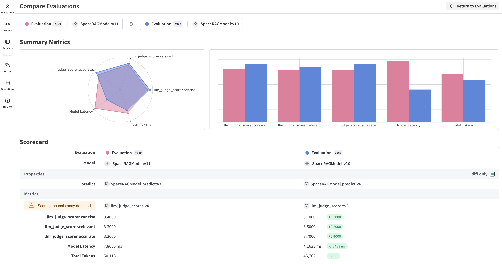

# Evaluations

To systematically improve your LLM application, it's helpful to test your changes against a consistent dataset of potential inputs so that you can catch regressions and inspect your applications behaviour under different conditions. In Weave, the `Evaluation` class is designed to assess the performance of a `Model` on a test dataset.

In a Weave Evaluation, a set of examples is passed through your application, and the output is scored according to multiple scoring functions. The result provides you with a overview of your application's performance in a rich UI to summarizing individual outputs and scores.



```python
import weave
from weave import Evaluation
import asyncio

# Collect your examples
examples = [
    {"question": "What is the capital of France?", "expected": "Paris"},
    {"question": "Who wrote 'To Kill a Mockingbird'?", "expected": "Harper Lee"},
    {"question": "What is the square root of 64?", "expected": "8"},
]

# Define any custom scoring function
@weave.op()
def match_score1(expected: str, model_output: dict) -> dict:
    # Here is where you'd define the logic to score the model output
    return {'match': expected == model_output['generated_text']}

@weave.op()
def function_to_evaluate(question: str):
    # here's where you would add your LLM call and return the output
    return  {'generated_text': 'Paris'}

# Score your examples using scoring functions
evaluation = Evaluation(
    dataset=examples, scorers=[match_score1]
)

# Start tracking the evaluation
weave.init('intro-example')
# Run the evaluation
asyncio.run(evaluation.evaluate(function_to_evaluate))
```

This page describes how to get started with evaluations. 
## Create an evaluation

To create an evaluation in Weave, follow these steps:

1. [Define an evaluation dataset](#define-an-evaluation-dataset)
2. [Define scoring functions](#define-scoring-functions)

### Create an evaluation dataset

First, create a test dataset that will be used to evaluate your application. Generally, the dataset should include failure cases that you want to test for, similar to software unit tests in Test-Driven Development (TDD). You have two options to create a dataset:

1. Define a [Dataset](/guides/core-types/datasets).
2. Define a list of dictionaries with a collection of examples to be evaluated. 

### Define scoring functions

Next, create a list of _Scorers_. Scorers are functions used to score each example. Scorers must have a `model_output` keyword argument. Other arguments are user defined and are taken from the dataset examples. The Scorer will only use the necessary keys by using a dictionary key based on the argument name.

When defining Scorers, you can either use one of the many predefined scorers available in Weave, or create your own custom Scorer.

#### Scorer example

In the following example, the `match_score1()` Scorer will take `expected` from the dictionary for scoring.

```python
import weave

# Collect your examples
examples = [
    {"question": "What is the capital of France?", "expected": "Paris"},
    {"question": "Who wrote 'To Kill a Mockingbird'?", "expected": "Harper Lee"},
    {"question": "What is the square root of 64?", "expected": "8"},
]

# Define any custom scoring function
@weave.op()
def match_score1(expected: str, model_output: dict) -> dict:
    # Here is where you'd define the logic to score the model output
    return {'match': expected == model_output['generated_text']}
```

#### Optional: Define a custom `Scorer` class

For some applications, you may want to create custom `Scorer` classes. For example, a standardized `LLMJudge` class should be created with specific parameters (e.g. chat model, prompt), scoring of each row, and calculation of an aggregate score. For more information about creating custom Scorers, see [Create your own Scorers](../evaluation/custom-scorers.md).

> For an end-to-end tutorial that involves defining a custom `Scorer` class, see [Model-Based Evaluation of RAG applications](/tutorial-rag#optional-defining-a-scorer-class).

### Define a Model to evaluate

Once your test dataset and Scorers are defined, you can begin the evaluation. To evaluate a `Model`, call `evaluate` on using an `Evaluation`. `Models` are used when you have attributes that you want to experiment with and capture in Weave.

The following example funs `predict()` on each example and scores the output with each scoring function defined in the `scorers` list using the `examples` dataset.

```python
from weave import Model, Evaluation
import asyncio

class MyModel(Model):
    prompt: str

    @weave.op()
    def predict(self, question: str):
        # here's where you would add your LLM call and return the output
        return {'generated_text': 'Hello, ' + self.prompt}

model = MyModel(prompt='World')

evaluation = Evaluation(
    dataset=examples, scorers=[match_score1]
)
weave.init('intro-example') # begin tracking results with weave
asyncio.run(evaluation.evaluate(model))
```


#### Custom Naming

You can change the name of the Evaluation itself by passing a `name` parameter to the `Evaluation` class.

```python
evaluation = Evaluation(
    dataset=examples, scorers=[match_score1], name="My Evaluation"
)
```

You can also change the name of individual evaluations by setting the `display_name` key of the `__weave` dictionary.

:::note

Using the `__weave` dictionary sets the call display name which is distinct from the Evaluation object name. In the
UI, you will see the display name if set, otherwise the Evaluation object name will be used.

:::

```python
evaluation = Evaluation(
    dataset=examples, scorers=[match_score1]
)
evaluation.evaluate(model, __weave={"display_name": "My Evaluation Run"})
```

### Define a function to evaluate

Alternatively, you can also evaluate a function that is wrapped in a `@weave.op()`.

```python
@weave.op()
def function_to_evaluate(question: str):
    # here's where you would add your LLM call and return the output
    return  {'generated_text': 'some response'}

asyncio.run(evaluation.evaluate(function_to_evaluate))
```

### Pulling it all together

```python
from weave import Evaluation, Model
import weave
import asyncio
weave.init('intro-example')
examples = [
    {"question": "What is the capital of France?", "expected": "Paris"},
    {"question": "Who wrote 'To Kill a Mockingbird'?", "expected": "Harper Lee"},
    {"question": "What is the square root of 64?", "expected": "8"},
]

@weave.op()
def match_score1(expected: str, model_output: dict) -> dict:
    return {'match': expected == model_output['generated_text']}

@weave.op()
def match_score2(expected: dict, model_output: dict) -> dict:
    return {'match': expected == model_output['generated_text']}

class MyModel(Model):
    prompt: str

    @weave.op()
    def predict(self, question: str):
        # here's where you would add your LLM call and return the output
        return {'generated_text': 'Hello, ' + question + self.prompt}

model = MyModel(prompt='World')
evaluation = Evaluation(dataset=examples, scorers=[match_score1, match_score2])

asyncio.run(evaluation.evaluate(model))

@weave.op()
def function_to_evaluate(question: str):
    # here's where you would add your LLM call and return the output
    return  {'generated_text': 'some response' + question}

asyncio.run(evaluation.evaluate(function_to_evaluate))
```
