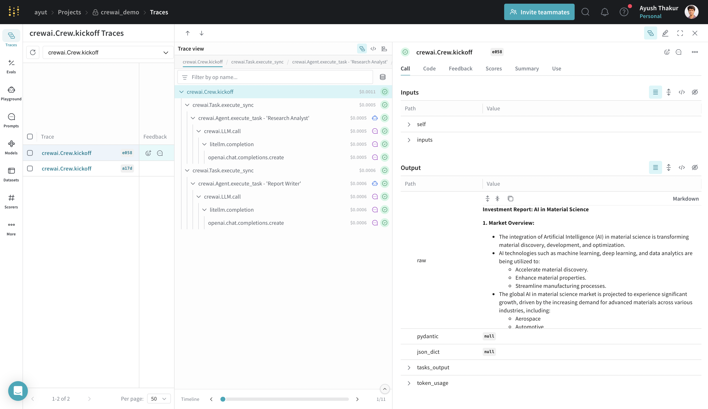
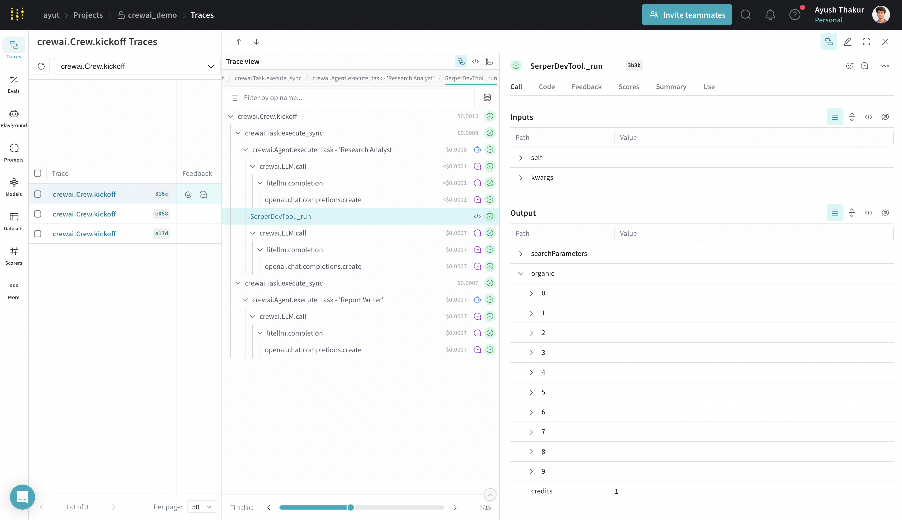
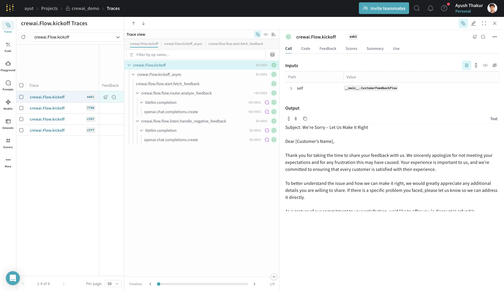
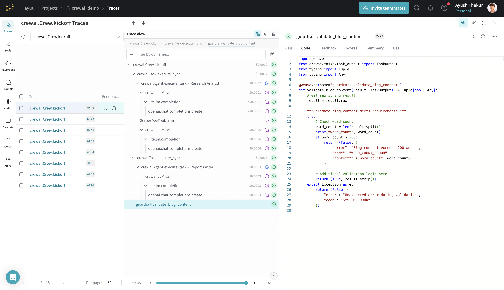

# CrewAI

<a target="_blank" href="https://colab.research.google.com/drive/1t8qlH99j-cCU2CceyGQQQY-p4oDbegxd?usp=sharing">
  
</a>

CrewAI is a lightweight, fast Python framework created completely from scratch—entirely independent of LangChain or other agent frameworks. CrewAI offers developers both high-level simplicity ([Crews](https://docs.crewai.com/guides/crews/first-crew)) and precise low-level control ([Flows](https://docs.crewai.com/guides/flows/first-flow)), making it ideal for crafting autonomous AI agents for any scenario. Learn more about [CrewAI here](https://docs.crewai.com/introduction).

Debugging and monitoring AI agents' interactions is essential. CrewAI applications typically involve multiple agents working together, so it's important to understand how they collaborate and communicate. Weave simplifies this process by automatically capturing traces in your CrewAI applications, allowing you to monitor and analyze agents' performance and interactions.

The integration supports both Crews and Flows.

## Getting Started with Crew

Install CrewAI ([more details](https://docs.crewai.com/installation)) and Weave to run this example:

```
pip install crewai weave
```

Create a CrewAI Crew and trace the execution using Weave. To begin, call `weave.init()` at the start of your script. The argument in `weave.init()` is a project name where the traces will be logged.

```python
import weave
from crewai import Agent, Task, Crew, LLM, Process

# Initialize Weave with your project name
# highlight-next-line
weave.init(project_name="crewai_demo")

# Create an LLM with a temperature of 0 to ensure deterministic outputs
llm = LLM(model="gpt-4o-mini", temperature=0)

# Create agents
researcher = Agent(
    role='Research Analyst',
    goal='Find and analyze the best investment opportunities',
    backstory='Expert in financial analysis and market research',
    llm=llm,
    verbose=True,
    allow_delegation=False,
)

writer = Agent(
    role='Report Writer',
    goal='Write clear and concise investment reports',
    backstory='Experienced in creating detailed financial reports',
    llm=llm,
    verbose=True,
    allow_delegation=False,
)

# Create tasks
research_task = Task(
    description='Deep research on the {topic}',
    expected_output='Comprehensive market data including key players, market size, and growth trends.',
    agent=researcher
)

writing_task = Task(
    description='Write a detailed report based on the research',
    expected_output='The report should be easy to read and understand. Use bullet points where applicable.',
    agent=writer
)

# Create a crew
crew = Crew(
    agents=[researcher, writer],
    tasks=[research_task, writing_task],
    verbose=True,
    process=Process.sequential,
)

# Run the crew
result = crew.kickoff(inputs={"topic": "AI in material science"})
print(result)
```

Weave tracks and logs all calls made through the CrewAI library, including agent interactions, task executions, and LLM calls. You can view the traces in the Weave web interface.

[](https://wandb.ai/ayut/crewai_demo/weave/traces?filter=%7B%22opVersionRefs%22%3A%5B%22weave%3A%2F%2F%2Fayut%2Fcrewai_demo%2Fop%2Fcrewai.Crew.kickoff%3A*%22%5D%7D&peekPath=%2Fayut%2Fcrewai_demo%2Fcalls%2F0195c7ac-bd52-7390-95a7-309370e9e058%3FhideTraceTree%3D0&cols=%7B%22wb_run_id%22%3Afalse%2C%22attributes.weave.client_version%22%3Afalse%2C%22attributes.weave.os_name%22%3Afalse%2C%22attributes.weave.os_release%22%3Afalse%2C%22attributes.weave.os_version%22%3Afalse%2C%22attributes.weave.source%22%3Afalse%2C%22attributes.weave.sys_version%22%3Afalse%7D)

:::note
CrewAI offers several methods for better control over the kickoff process: `kickoff()`, `kickoff_for_each()`, `kickoff_async()`, and `kickoff_for_each_async()`. The integration supports logging traces from all these methods.
:::

## Track Tools

CrewAI tools enhance agents with capabilities like web searching, data analysis, collaboration, and delegating tasks among coworkers. The integration can trace these activities as well.

Improve the quality of the generated report in the above example by providing access to a tool that searches the internet and returns the most relevant results.

First, install the extra dependency.

```
pip install 'crewai[tools]'
```

In this example, use the `SerperDevTool` to enable the 'Research Analyst' agent to find relevant information online. Learn more about this tool and API requirements [here](https://docs.crewai.com/tools/serperdevtool).

```python
# .... existing imports ....
from crewai_tools import SerperDevTool

# Provide the agent with the tool.
researcher = Agent(
    role='Research Analyst',
    goal='Find and analyze the best investment opportunities',
    backstory='Expert in financial analysis and market research',
    llm=llm,
    verbose=True,
    allow_delegation=False,
    # highlight-next-line
    tools=[SerperDevTool()],
)

# .... existing code ....
```

Running this Crew with an agent that has internet access produces a better and more relevant result. The tool usage is automatically traced, as shown in the image below.

[](https://wandb.ai/ayut/crewai_demo/weave/traces?filter=%7B%22opVersionRefs%22%3A%5B%22weave%3A%2F%2F%2Fayut%2Fcrewai_demo%2Fop%2Fcrewai.Crew.kickoff%3A*%22%5D%7D&peekPath=%2Fayut%2Fcrewai_demo%2Fcalls%2F0195c7c7-0213-7f42-b130-caa93a79316c%3FdescendentCallId%3D0195c7c7-0a16-7f11-8cfd-9dedf1d03b3b&cols=%7B%22wb_run_id%22%3Afalse%2C%22attributes.weave.client_version%22%3Afalse%2C%22attributes.weave.os_name%22%3Afalse%2C%22attributes.weave.os_release%22%3Afalse%2C%22attributes.weave.os_version%22%3Afalse%2C%22attributes.weave.source%22%3Afalse%2C%22attributes.weave.sys_version%22%3Afalse%7D)

:::note
The integration automatically patches all the tools available in the [`crewAI-tools`](https://github.com/crewAIInc/crewAI-tools) repository. 
:::

## Getting Started with Flow

```python
import weave
# Initialize Weave with your project name
# highlight-next-line
weave.init("crewai_demo")

from crewai.flow.flow import Flow, listen, router, start
from litellm import completion


class CustomerFeedbackFlow(Flow):
    model = "gpt-4o-mini"

    @start()
    def fetch_feedback(self):
        print("Fetching customer feedback")
        # In a real-world scenario, this could be replaced by an API call.
        # For this example, we simulate customer feedback.
        feedback = (
            "I had a terrible experience with the product. "
            "It broke after one use and customer service was unhelpful."
        )
        self.state["feedback"] = feedback
        return feedback

    @router(fetch_feedback)
    def analyze_feedback(self, feedback):
        # Use the language model to analyze sentiment
        prompt = (
            f"Analyze the sentiment of this customer feedback and "
            "return only 'positive' or 'negative':\n\n"
            f"Feedback: {feedback}"
        )
        response = completion(
            model=self.model,
            messages=[{"role": "user", "content": prompt}],
        )
        sentiment = response["choices"][0]["message"]["content"].strip().lower()
        # If the response is ambiguous, default to negative
        if sentiment not in ["positive", "negative"]:
            sentiment = "negative"
        return sentiment

    @listen("positive")
    def handle_positive_feedback(self):
        # Generate a thank you message for positive feedback
        prompt = "Generate a thank you message for a customer who provided positive feedback."
        response = completion(
            model=self.model,
            messages=[{"role": "user", "content": prompt}],
        )
        thank_you_message = response["choices"][0]["message"]["content"].strip()
        self.state["response"] = thank_you_message
        return thank_you_message

    @listen("negative")
    def handle_negative_feedback(self):
        # Generate an apology message with a promise to improve service for negative feedback
        prompt = (
            "Generate an apology message to a customer who provided negative feedback and offer assistance or a solution."
        )
        response = completion(
            model=self.model,
            messages=[{"role": "user", "content": prompt}],
        )
        apology_message = response["choices"][0]["message"]["content"].strip()
        self.state["response"] = apology_message
        return apology_message

# Instantiate and kickoff the flow
flow = CustomerFeedbackFlow()
result = flow.kickoff()
print(result)
```

[](https://wandb.ai/ayut/crewai_demo/weave/traces?filter=%7B%22opVersionRefs%22%3A%5B%22weave%3A%2F%2F%2Fayut%2Fcrewai_demo%2Fop%2Fcrewai.Flow.kickoff%3A*%22%5D%7D&peekPath=%2Fayut%2Fcrewai_demo%2Fcalls%2F0195c7e3-7a63-7283-bef4-9e0eb2f0eab1&cols=%7B%22wb_run_id%22%3Afalse%2C%22attributes.weave.client_version%22%3Afalse%2C%22attributes.weave.os_name%22%3Afalse%2C%22attributes.weave.os_release%22%3Afalse%2C%22attributes.weave.os_version%22%3Afalse%2C%22attributes.weave.source%22%3Afalse%2C%22attributes.weave.sys_version%22%3Afalse%7D)

:::note
The integration automatically patches the `Flow.kickoff` entry point and all available decorators -- `@start`, `@listen`, `@router`, `@or_`, and `@and_`.
:::

## Crew Guardrail - Track Your Custom Operations

Task guardrails allow validation and transformation of task outputs before passing them to the next task. Use a simple Python function to validate the agent's execution on-the-fly.

By wrapping this function with `@weave.op`, you can capture inputs, outputs, and application logic to debug data validation through your agents. This also automatically versions code as you experiment, capturing uncommitted details.

Let's take the example of the research analyst and writer. Add a guardrail to validate the length of the generated report.

```python
# .... existing imports and weave initialization ....

# Decorate your guardrail function with `@weave.op()`
# highlight-next-line
@weave.op(name="guardrail-validate_blog_content")
def validate_blog_content(result: TaskOutput) -> Tuple[bool, Any]:
    # Get raw string result
    result = result.raw

    """Validate blog content meets requirements."""
    try:
        # Check word count
        word_count = len(result.split())

        if word_count > 200:
            return (False, {
                "error": "Blog content exceeds 200 words",
                "code": "WORD_COUNT_ERROR",
                "context": {"word_count": word_count}
            })

        # Additional validation logic here
        return (True, result.strip())
    except Exception as e:
        return (False, {
            "error": "Unexpected error during validation",
            "code": "SYSTEM_ERROR"
        })


# .... existing agents and research analyst task ....

writing_task = Task(
    description='Write a detailed report based on the research under 200 words',
    expected_output='The report should be easy to read and understand. Use bullet points where applicable.',
    agent=writer,
    # highlight-next-line
    guardrail=validate_blog_content,
)

# .... existing code to run crew ....
```

By decorating the guardrail function with `@weave.op`, you can track the input and output of this function, along with execution time, token information if an LLM is used, code versioning, and more.

[](https://wandb.ai/ayut/crewai_demo/weave/traces?filter=%7B%22opVersionRefs%22%3A%5B%22weave%3A%2F%2F%2Fayut%2Fcrewai_demo%2Fop%2Fcrewai.Crew.kickoff%3A*%22%5D%7D&peekPath=%2Fayut%2Fcrewai_demo%2Fcalls%2F0195c838-38cb-71a2-8a15-651ecddf9d89%3FdescendentCallId%3D0195c838-8632-7173-846d-f230e7272c20&cols=%7B%22wb_run_id%22%3Afalse%2C%22attributes.weave.client_version%22%3Afalse%2C%22attributes.weave.os_name%22%3Afalse%2C%22attributes.weave.os_release%22%3Afalse%2C%22attributes.weave.os_version%22%3Afalse%2C%22attributes.weave.source%22%3Afalse%2C%22attributes.weave.sys_version%22%3Afalse%7D)

## Conclusion

Let us know how we can improve this integration. If you encounter an issue, please open one [here](https://github.com/wandb/weave/issues/new/choose).

Learn more about building powerful multi-agent systems using CrewAI through their [many examples](https://github.com/crewAIInc/crewAI-examples) and [documentation](https://docs.crewai.com/introduction).