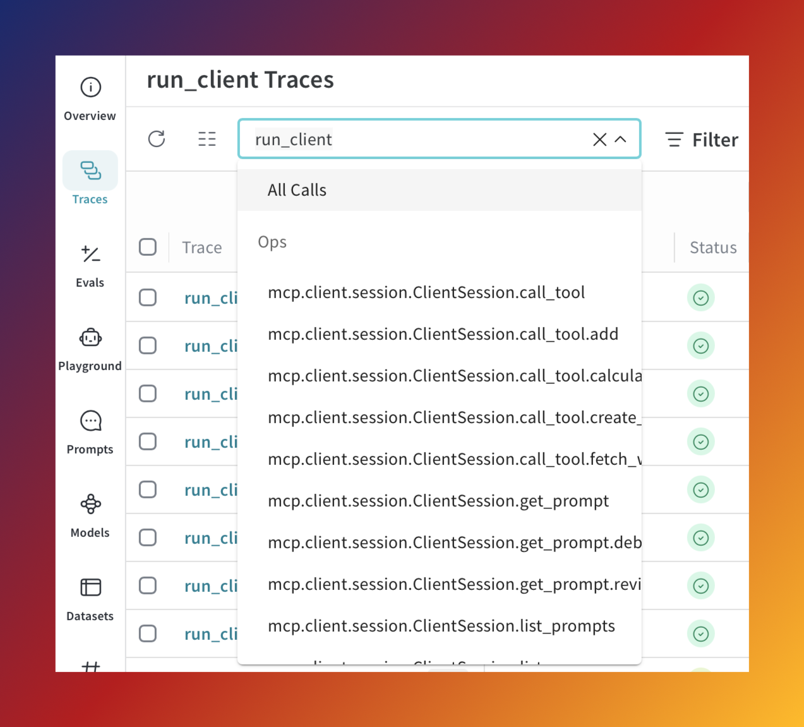
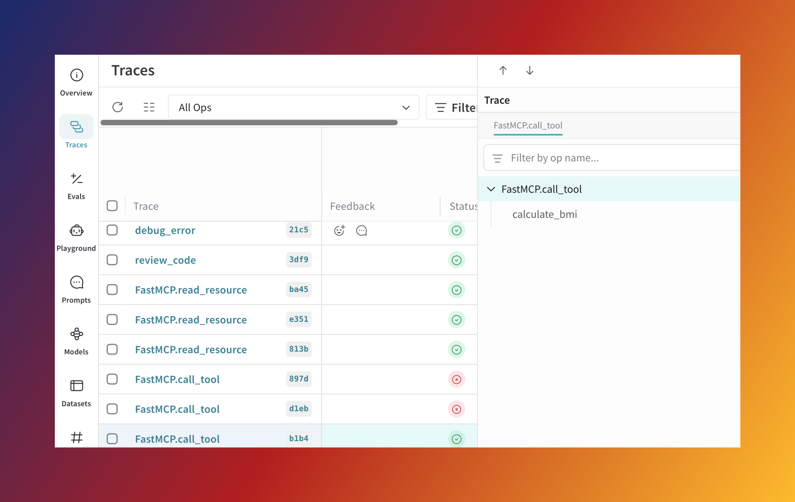

# Model Context Protocol (MCP)

<a target="_blank" href="https://colab.research.google.com/drive/174VzXlU5Qcgvjt4OoIWN-guTxJcOefAh?usp=sharing">
  
</a>

The Model Context Protocol (MCP) serves as a unified communication standard that enables AI applications to exchange information with Large Language Models (LLMs). Similar to how universal connectors revolutionized hardware connectivity, MCP promises to create a consistent interface for LLMs to access various data sources and interact with external tools, eliminating the need for custom integrations for each new service.

The Weave integration allows you to trace your MCP Client and MCP Server. This integration provides detailed visibility into tool calls, resource access, and prompt generation within MCP-based systems.

We automatically patch the key methods of [`mcp.server.fastmcp.FastMCP`](https://github.com/modelcontextprotocol/python-sdk/blob/b4c7db6a50a5c88bae1db5c1f7fba44d16eebc6e/src/mcp/server/fastmcp/server.py#L109) and [`mcp.ClientSession`](https://github.com/modelcontextprotocol/python-sdk/blob/b4c7db6a50a5c88bae1db5c1f7fba44d16eebc6e/src/mcp/client/session.py#L84) class with a [`weave.op()`](../tracking/ops.md) decorator.

We trace the following key components -- [**Tools**](https://modelcontextprotocol.io/docs/concepts/tools), [**Resources**](https://modelcontextprotocol.io/docs/concepts/resources), [**Prompts**](https://modelcontextprotocol.io/docs/concepts/prompts)

[](https://wandb.ai/ayut/mcp_example/weave/traces?filter=%7B%22opVersionRefs%22%3A%5B%22weave%3A%2F%2F%2Fayut%2Fmcp_example%2Fop%2Frun_client%3A*%22%5D%7D&peekPath=%2Fayut%2Fmcp_example%2Fcalls%2F01966bbe-cc5e-7012-b45f-bf10617d8c1e%3FhideTraceTree%3D0)

## Using the Integration

### Installation

To use the MCP integration with weave, you'll need to install both weave and the MCP package:

```bash
pip install -qq mcp[cli] weave
```

### Server-Side Integration

The code snippet below shows how to write a very simple `FastMCP server`. You can start tracing with two extra lines of code:

```python
# highlight-next-line
import weave
from mcp.server.fastmcp import FastMCP

# Initialize Weave
# highlight-next-line
weave_client = weave.init("my-project")

# Create an MCP server
mcp = FastMCP("Demo")

# Define tools (will be traced)
@mcp.tool()
def add(a: int, b: int) -> int:
    """Add two numbers"""
    return a + b

# Define resources (will be traced)
@mcp.resource("greeting://{name}")
def get_greeting(name: str) -> str:
    """Get a personalized greeting"""
    return f"Hello, {name}!"

# Define prompts (will be traced)
@mcp.prompt()
def review_code(code: str) -> str:
    """Generate a code review prompt"""
    return f"Please review this code:\n\n{code}"

# Run the server
mcp.run(transport="stdio")
```

### Client-Side Integration

Similary on the client side, add two lines of code to enable tracing your MCP client:

```python
# highlight-next-line
import weave
from mcp import ClientSession, StdioServerParameters
from mcp.client.stdio import stdio_client

# Initialize Weave
# highlight-next-line
weave_client = weave.init("my-project")

# The MCP client operations will be automatically traced
async with stdio_client(server_params) as (read, write):
    async with ClientSession(read, write) as session:
        # Initialize the connection
        await session.initialize()
        
        # Call a tool (this will be traced)
        result = await session.call_tool("add", arguments={"a": 1, "b": 2})
        
        # Read a resource (this will be traced)
        resource = await session.read_resource("greeting://user")
        
        # Get a prompt (this will be traced)
        prompt = await session.get_prompt("review_code", arguments={"code": "print('Hello')"})
```

### Configuration

The MCP integration can be configured through environment variables:

- `MCP_TRACE_LIST_OPERATIONS`: Set to "true" to trace list operations (`list_tools`, `list_resources`, etc.)

## Why is tracing ability needed?

As a developer you can fall into one of three categories:

- **MCP server-side developer**: You want to expose multiple tools, resources, and prompts to the MCP client. You expose your existing application's tools, resources, etc., or you have built agents or have multiple agents orchestrated by an orchestrator agent. 

- **MCP client-side developer**: You might want to plug your client-side application into multiple MCP servers. A core part of your client-side logic is making LLM calls to decide which tool to call or which resource to fetch.

- **MCP server and client developer**: You are developing both the server and the client.

If you fall into the first two categories, you want to know when each tool is called, what the execution flow looks like, the token count, and latency of different components in your server or client-side logic. 

If you are developing both the server and client, the ability to see a unified trace timeline (we don't yet capture server-client interaction) can help you quickly iterate through both server and client-side logic.

:::Note
Currently our integration captures client-side and server-side operations separately, but does not provide visibility into their interaction. There's an ongoing proposal created by us to add OpenTelemetry trace support to MCP that would enable end-to-end observability - see [GitHub discussion #269](https://github.com/modelcontextprotocol/modelcontextprotocol/discussions/269).
:::

With an observability layer you can:

- Quickly iterate through your application
- Audit the workflow or execution logic
- Identify bottlenecks

## Quickstart Guide

We also have a quickstart guide to show how you can create a MCP server and client and trace it using Weave.

### Using the Example Code

1. Clone the Weave repository and navidate to the MCP demo directory to run the quickstart guide:
   ```bash
   git clone https://github.com/wandb/weave
   cd weave/examples/mcp_demo
   ```

2. Install the required dependencies:
   Alternatively you can do:
   ```bash
   pip install mcp[cli] weave
   ```

The example consists of two main files:
- `example_server.py`: A demo MCP server built using `FastMCP` with various tools, resources, and prompts.
- `example_client.py`: A client that connects to the server.

To run the example:

```bash
python example_client.py example_server.py
```

This will start the client, which will connect to and interact with the server. The client provides a command-line interface with the following options:

- `tools` - List all available tools
- `resources` - List all available resources
- `prompts` - List all available prompts
- `add <a> <b>` - Add two numbers
- `bmi <weight_kg> <height_m>` - Calculate BMI
- `weather <city>` - Get weather for a city
- `greeting <name>` - Get personalized greeting
- `user <id>` - Get user profile
- `config` - Get application configuration
- `code-review <code>` - Get code review prompt
- `debug <error>` - Get debug error prompt
- `demo` - Run demos for all features
- `q` - Exit the session

If you type `demo`, the client will run through all the features. The image shown above is the trace timeline you should get by doing so.Typing `q` will close the process. If you want to play with the available features, try individual commands listed above.

:::Tip
By default, you will just see the `run_client` traces. Click on the Ops selection box and select "All Calls"

[]

Doing so will show you `FastMCP` methods (tools, resources, prompts) traced by the integration. You can see the arguments given to the tools and returned values.

[](https://wandb.ai/ayut/mcp_example/weave/traces?peekPath=%2Fayut%2Fmcp_example%2Fcalls%2F01966bc2-aca1-7021-a626-aecfe677b1b4%3FhideTraceTree%3D0)
:::

### Understanding the Example

#### Server-Side Code

The example server (`example_server.py`) defines:

1. **Tools**: Functions like `add()`, `calculate_bmi()`, and `fetch_weather()`
2. **Resources**: Data endpoints like `greeting://{name}`, `config://app`, and `users://{user_id}/profile`
3. **Prompts**: Templates like `review_code()` and `debug_error()`

All of these components are automatically traced by Weave, allowing you to monitor their usage, inputs, and outputs. This tracing is enabled by just initializing a weave client (`weave.init`).

#### Client-Side Code

The example client (`example_client.py`) demonstrates:

1. How to connect to an MCP server
2. How to discover available tools, resources, and prompts
3. How to call tools with parameters
4. How to access resources with URIs
5. How to generate prompts with arguments

All client-side operations are also traced by Weave, creating a complete picture of the client-server interaction.
