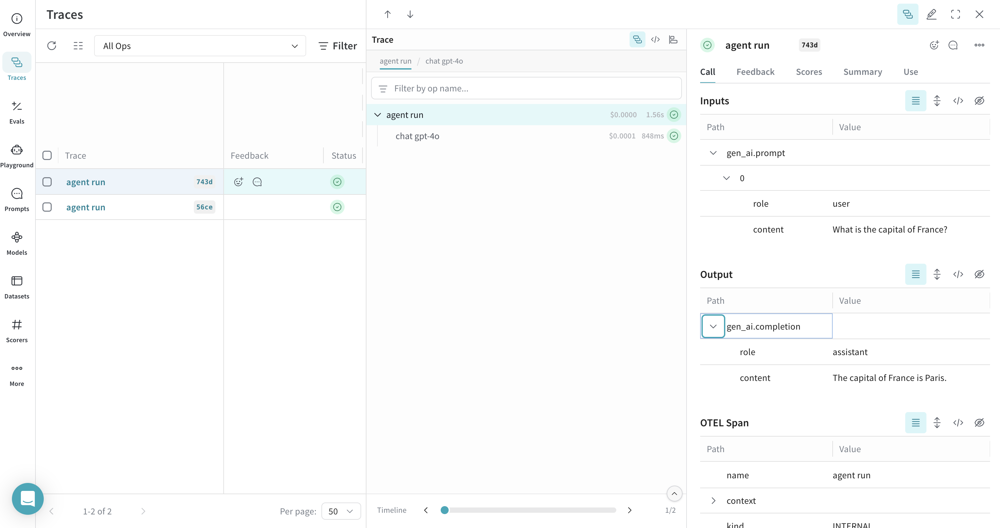

# PydanticAI

<!-- TODO: Add link to colab once the PR is merged. -->

[PydanticAI](https://github.com/pydantic/pydantic-ai) is a library that lets you build agents with type-safe input validation and output parsing using Pydantic models.

## Tracing

It's important to store traces of language model applications in a central location, both during development and in production. These traces can be useful for debugging and as a dataset that will help you improve your application.

Weave will automatically capture traces for [PydanticAI](https://github.com/pydantic/pydantic-ai) agents. To start tracking, call `weave.init(project_name="<YOUR-WANDB-PROJECT-NAME>")` and use the library as normal.

```python
from pydantic_ai import Agent
import weave

# Initialize Weave
weave.init(project_name="pydantic-ai-test")

# Create a PydanticAI agent
agent = Agent("openai:gpt-4o")

# Run a simple query
result = agent.run_sync("What is the capital of France?")
print(result.output)
```

|                                                                                          |
| ------------------------------------------------------------------------------------------------------------------------------------- |
| Weave will now track and log all application and llm calls made using PydanticAI. You can view the traces in the Weave web interface. |

## Tool Calls

PydanticAI makes it easy to create and use tools with your agents. Weave automatically traces these tool calls, capturing both the inputs to the tools and their outputs.

```python
from pydantic_ai import Agent
import weave

# Initialize Weave
weave.init(project_name="pydantic-ai-test")

# Create a PydanticAI agent with a system prompt
agent = Agent(
    "openai:gpt-4o",
    system_prompt=(
        "You are a helpful assistant that can multiply numbers. "
        "When asked to multiply numbers, use the multiply tool."
    ),
)

# Define a tool
@agent.tool_plain
def multiply(a: int, b: int) -> int:
    """Multiply two numbers."""
    return a * b

# Ask the agent to use the tool
result = agent.run_sync("What is 7 multiplied by 8?")
print(result.output)
```

|                                                                                 |
| -------------------------------------------------------------------------------------------------------------------------------- |
| Weave traces both the agent calls and any tool calls the agent makes, allowing you to see the complete flow of your application. |

| Decorating the `get_weather` function with `@weave.op` traces its inputs, outputs, and all internal LLM calls made inside the function. |

## Create a `Model` for easier experimentation

Organizing experimentation is difficult when there are many moving pieces. By using the [`Model`](../core-types/models) class, you can capture and organize the experimental details of your app like your system prompt or the model you're using. This helps organize and compare different iterations of your app.

In addition to versioning code and capturing inputs/outputs, [`Model`](../core-types/models)s capture structured parameters that control your application's behavior, making it easy to find what parameters worked best. You can also use Weave Models with `serve`, and [`Evaluation`](../core-types/evaluations.md)s.

In the example below, you can experiment with `WeatherAssistant`. Every time you change one of these parameters, you'll get a new _version_ of `WeatherAssistant`.

```python
import asyncio
from typing import Optional
from pydantic import BaseModel

import weave
from pydantic_ai import Agent


# Define output model
class WeatherForecast(BaseModel):
    temperature: float
    conditions: str
    location: str
    forecast: str


class WeatherAssistant(weave.Model):
    openai_model: str
    system_prompt: str
    temperature: float = 0.7

    @weave.op()
    async def predict(self, location: str) -> WeatherForecast:
        # Create a new agent with the model's parameters
        agent = Agent(
            self.openai_model,
            system_prompt=self.system_prompt,
            temperature=self.temperature,
        )
        
        # Run the agent
        result = await agent.run(
            f"Generate a weather forecast for {location}. Be creative but realistic."
        )
        
        # Parse the result
        # In a real application, you'd call a real weather API
        forecast = WeatherForecast.model_validate_json(result.output)
        return forecast


# Create the model
model = WeatherAssistant(
    openai_model="gpt-4o", 
    system_prompt="You are a helpful weather forecasting assistant. Your responses should be formatted as valid JSON according to the WeatherForecast model."
)

# Make a prediction
forecast = asyncio.run(model.predict("London"))
print(f"Weather forecast for {forecast.location}: {forecast.temperature}°F, {forecast.conditions}")
print(forecast.forecast)
```

## Serving a Weave Model

Given a weave reference to a `weave.Model` object, you can spin up a FastAPI server and [`serve`](https://wandb.github.io/weave/guides/tools/serve) it.


You can find the weave reference of any `weave.Model` by navigating to the model and copying it from the UI.

You can serve your model by using the following command in the terminal:

```shell
weave serve weave:///your_entity/project-name/WeatherAssistant:<hash>
``` 